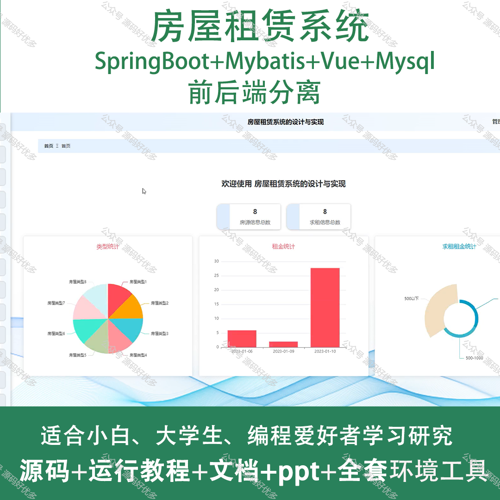
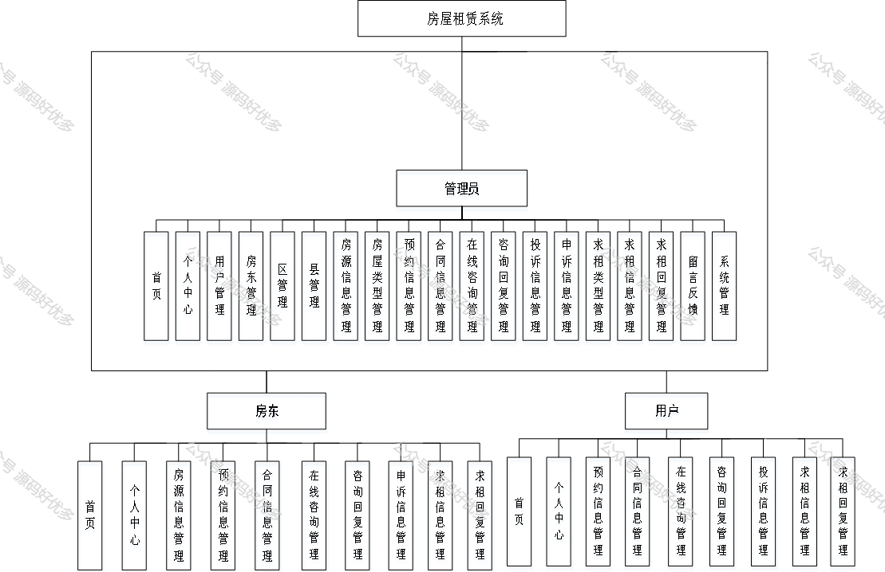
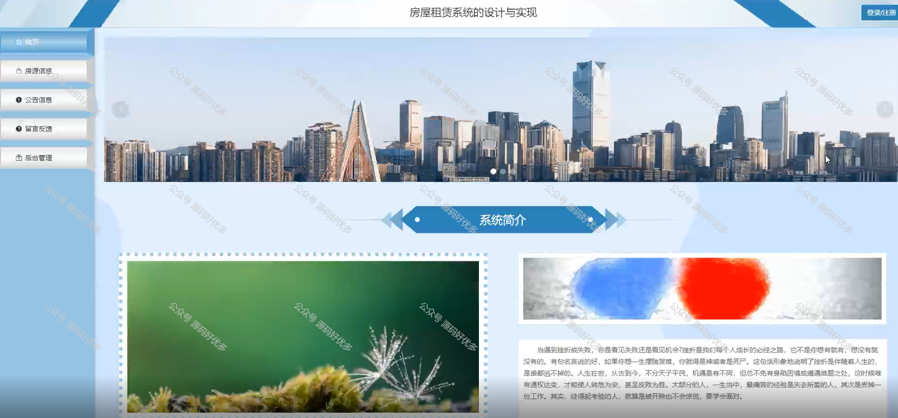
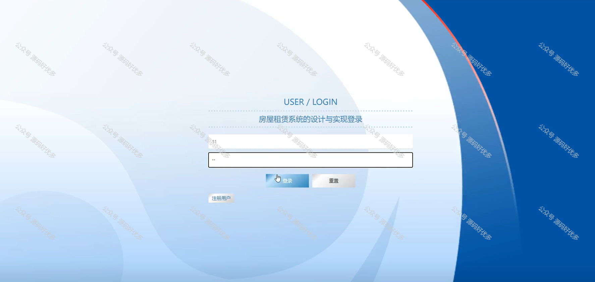
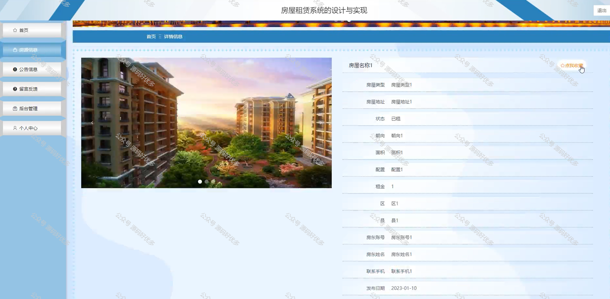
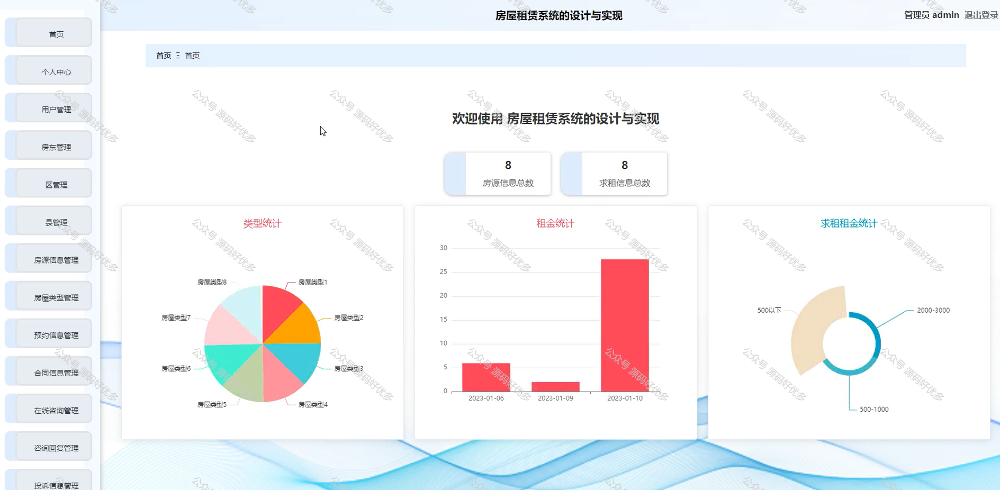
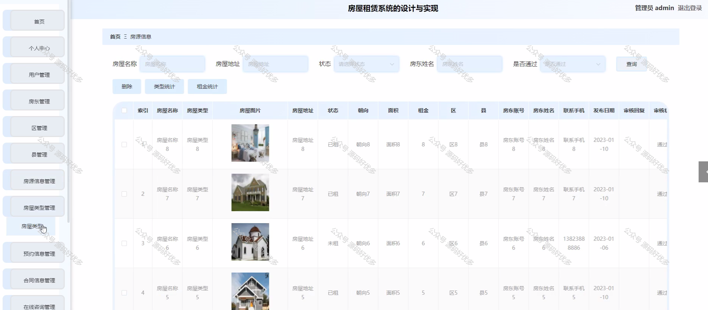
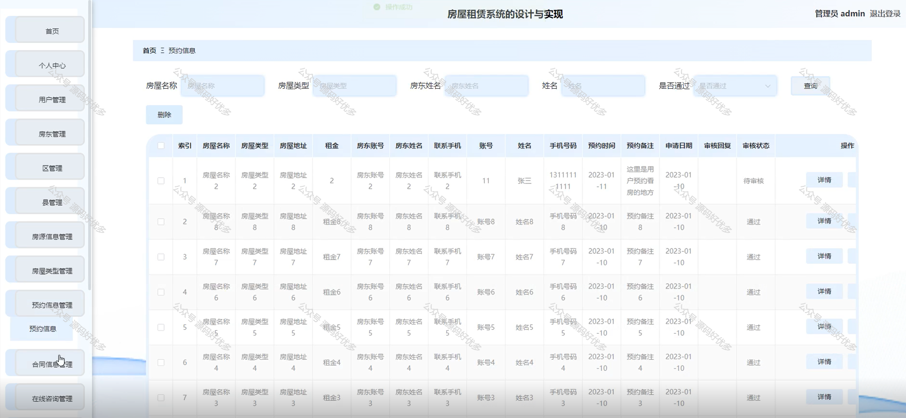
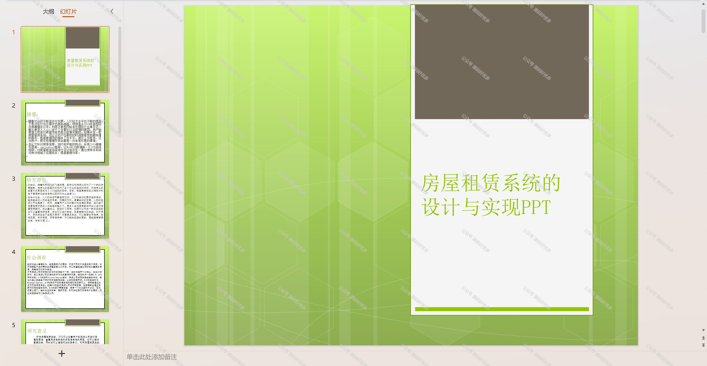
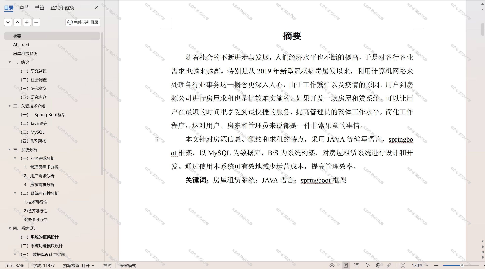

 
## 查看主页获取源码

### 一、作品包含

源码+数据库+设计文档万字+PPT+全套环境和工具资源+部署教程

### 二、项目技术

前端技术：Html、Css、Js、Vue、Element-ui

数据库：MySQL

后端技术：Java、Spring Boot、MyBatis

  

### 三、运行环境

开发工具：IDEA/eclipse

数据库：MySQL5.7

数据库管理工具：Navicat10以上版本

环境配置软件： JDK1.8+Maven3.6.3

前端Nodejs：14

### 四、项目介绍
项目编号：springbootA150

房屋租赁系统在房地产市场日益繁荣的背景下应运而生，它旨在通过信息化手段简化租赁流程，提高房屋资源配置效率，为租户和房东提供一个安全、便捷、透明的交易平台，满足市场对快速、高效租赁服务的需求，同时规范租赁市场秩序，保障租赁双方的合法权益。

系统分为管理员、用户、房东
管理员的功能：首页、个人中心、用户管理、房东管理、区管理、县管理、房源信息管理、房屋类型管理、预约信息管理、合同信息管理、在线咨询管理、咨询回复管理、投诉信息管理、申诉信息管理、求租类型管理、求租信息管理、求租回复管理、留言反馈、系统管理。
用户的功能：首页、个人中心、预约信息管理、合同信息管理、在线咨询管理、咨询回复管理、投诉信息管理和求租信息管理、求租回复管理。
房东的功能：首页、个人中心、房源信息管理、预约信息管理、合同信息管理、在线咨询管理、咨询回复管理、申诉信息管理、求租信息管理以及求租回复管理。

### 五、运行截图

  
